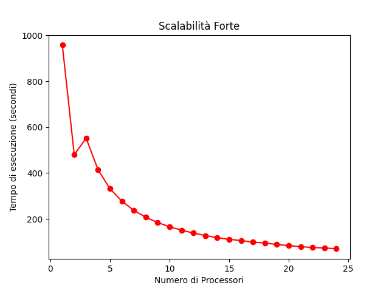
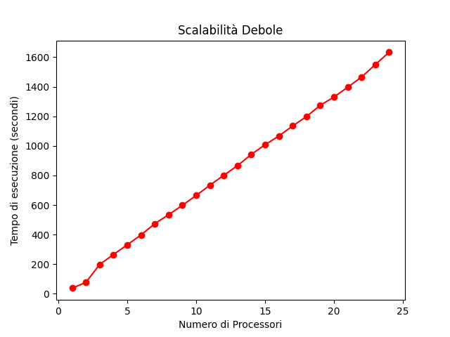

# N-Body Parallel Programming


## Introduzione

Il problema N-Body consiste trovare le posizioni e le velocità di un insieme di particelle interagenti nel tempo. Ad esempio, un astrofisico potrebbe voler conoscere le posizioni e le velocità di un gruppo di stelle. Al contrario, un chimico potrebbe voler conoscere le posizioni e le velocità di un insieme di molecole o atomi.
Un programma che risolve il problema N-Body simula il comportamento delle particelle. L'input del problema è la massa, la posizione e la velocità di ciascuna particella all'inizio della simulazione e l'output è tipicamente la posizione e la velocità di ciascuna particella in sequenza di tempi specificati dall'utente, o semplicemente la posizione e la velocità di ciascuna particella al termine di un tempo specificato dall'utente.

## Breve descrizione della soluzione

Per risolvere il problema si è considerata la soluzione quadratica nel numero di particelle, però anche l'algoritmo Barnes-Hut può essere considerato, ma dovrebbe essere più difficile da sviluppare. Per la parte matematica, cioè nel calcolo della forza dei corpi, si è presa in considerazione la [soluzione di Harrism] (https://github.com/harrism/mini-nbody/blob/master/nbody.c). Il programma è in grado di simulare il processo per un determinato numero di cicli stabiliti dall'utente. Il processo MASTER inizializza un array di body in modo pseudocasuale e lo invia ai processori P-1. Nella nostra soluzione si è deciso che il processo MASTER contribuisce alla computazione, ma si potrebbe anche scegliere che il processo MASTER non partecipi al calcolo. Ogni SLAVE simula la forza dei corpi (bodyForce), solo per i suoi corpi, e invia i risultati dei suoi corpi a tutti gli altri processori, necessari per la fase successiva della simulazione. Al termine della simulazione ogni processo SLAVE invia il suo gruppo di body al processo MASTER il quale stamperà i risultati della simulazione.

## Dettagli dell’implementazione

In questa sezione si vedrà l'implementazione nei dettagli del problema n-body. Si inizia parlando di come si è rappresentato un singolo body, poi si parla di come si è suddiviso il problema tra i processori, e infine si parla della computazione e comunicazione di ogni processore.

### Definizione della struttura Body
Ogni body `e stato rappresentato con una struct, in questo modo:
``` c
typedef struct { 
  float x, y, z, vx, vy, vz; 
} Body;
```
La struttura è rappresentata da 6 valori float, i primi 3 valori (x,y e z) rappresentano la posizione, mentre i restanti (vx,vy e vz) rappresentano la velocità.

### Inizializzazione
Prima di inizializzare l'array di body, bisogna creare un nuovo tipo di dato in MPI in modo tale che il body possa essere inviato e ricevuto da un processore. Lo snippet di codice che effettua questo procedimento è il seguente:
``` c
MPI_Datatype body_type;
MPI_Type_contiguous(6,MPI_FLOAT,&body_type);
MPI_Type_commit(&body_type);
```
Si è definito una nuova variabile bodytype di tipo MPI_Datatype, poi viene chiamata la routine MPI_Type_contiguos che replica 6 volte il tipo di dato float in locazioni di memoria contigue, prima di essere usato nelle comunicazioni il tipo di dato nuovo deve essere commitato tramite la routine MPI_Type_commit.
Dopo aver creato il nuovo tipo di dato in MPI, si passa alla fase d'inizializzazione dove il processo MASTER in maniera pseudocasuale inizializza i body tramite la funzione randomizedBodies:
``` c
 if (world_rank == 0) {
    randomizeBodies(buf, 6*nBodies);
  }
```
La funzione randomizeBodies è definita in questo modo:
``` c
void randomizeBodies(float *data, int n) {
  for (int i = 0; i < n; i++) {
    data[i] = 2.0 * (rand() / (float)RAND_MAX) - 1.0f;
  }
  
}
```
Dove il parametro n è indica il numero di body fornito in input al programma, mentre *datà è un puntatore di tipo float che punta all'array di body di dimensione n, che viene definito in questo modo:
``` c
int nBodies = atoi(argv[1]);
int bytes = nBodies*sizeof(Body);
float *buf = (float*)malloc(bytes);
Body *p = (Body*)buf;
```
### Suddivisione task
Una volta effettuata la fase d'inizializzazione, bisogna fare in modo che ogni processore riceva un carico di body  di dimensione minore rispetto all'input e dove simula la forza dei corpi  tramite la funzione bodyForce e BodyForceEsclude che verranno presentate in seguito. \newline Per dividere i body tra i processori, si è utilizzato la routine:
``` c
int MPI_Scatterv(const void* buffer_send,
const int counts_send[],
const int displacements[], 
MPI_Datatype datatype_send,
void* buffer_recv,
int count_recv,
MPI_Datatype datatype_recv,
int root,
MPI_Comm communicator); 
```
Dove:
- **buffer_send:** Il buffer contenente i dati da inviare agli altri processori. 
- **counts_send:** Un array che contiene il numero di elementi da inviare a ciascun processore.
- **displacements:** Un array contenente lo spostamento da applicare al messaggio inviato a ciascun processore..
- **datatype_send:** il tipo di dato del buffer di invio.
- **buffer_recv:** il buffer in cui archiviare i dati inviati.
- **count_recv:** Il numero di elementi nel buffer di ricezione.
- **datatype_recv:** il tipo di dato del buffer di ricezione.
- **root:** il rank del processore che invierà i dati ai processori.
- **communicator:** il communicatore in cui avviene la scatter.

Tramite il seguente snippet di codice si sono calcolati i vari parametri della routine MPI_Scatterv:
``` c
int rest = nBodies % (world_size); 
int portion = nBodies / (world_size); 
int send_counts[world_size];
int offset[world_size];
int sum = 0;
for (int i = 0; i < world_size;i++) {
    send_counts[i] = portion;
    if (rest > 0) {
      send_counts[i]++;
      rest--;
    }
    offset[i] = sum;
    sum+= send_counts[i];
  }
```

Questo snippet di codice sfrutta che il resto della divisione è sempre minore del divisore. Nel caso in cui il resto è pari a zero, ogni processore riceve la stessa porzione di body e la porzione viene definita nella variabile **portion**. Nel caso in cui il resto non è zero, significa che l'input non è divisibile per il numero di processori, quindi lo snippet di codice aggiunge un body in più al processore i-esimo,  finché non si raggiunge con la variabile **rest** il valore zero, questo ci permette di computare tutti i body e non escludere dalla computazione un numero di body pari al resto.Supponiamo di effettuare un esempio avendo in input un numero di body uguale a 10 e 3 processori, la suddivisione dei task sarebbe 4 body al primo processore, 3 body al secondo processore e 3 body al terzo processore

### Computazione e Comunicazione tra i processi

Terminata la fase di inzializzazione, inzia la fase in cui ogni processo possiede i suoi body  e calcola le forze dei corpi usando bodyForce e bodyForceEsclude. Innanzitutto, si è deciso di utilizzare un tipo di comunicazione non bloccante, perché in questo modo non bisogna attendere il completamento della comunicazione, ma si può compiere altre operazioni e nel nostro caso è la funzione bodyForce che effettua il  calcolo delle forze sui body. La comunicazione non bloccante utilizzata è la routine di MPI denominata **MPI\_Iallgatherv**  che permette di inviare i body di appartenenza a tutti gli altri processori in modo tale da completare la computazione. Dato che si tratta di una comunicazione non bloccante, come ho detto prima, in attesa che la comunicazione venga completata si è sfruttata questo tempo nel calcolare le forze sui body di appartenenza che il processore possiede. Lo snippet di codice che effettua questa fase è il seguente:
``` c
MPI_Iallgatherv(&p[offset[world_rank]],
send_counts[world_rank],
body_type,
p,
send_counts,
offset,body_type,
MPI_COMM_WORLD,
&request);
bodyForce(&p[offset[world_rank]],dt,send_counts[world_rank]);
```
Lo snippet di codice  utilizza **MPI_Iallgatherv** che riceve come argomenti l'indirizzo dei body da inviare, il numero di body posseduti dal processore, il tipo di dato che si invia, il buffer in cui archiviare i body raccolti, un array contenente il numero di body da ricevere da ogni processore, un array contenente l' indice di partenza(displacements) dei body ricevuti, il tipo di dato che si riceve, il comunicatore, e infine la variabile in cui archiviare il gestore per determinare se la richiesta è stata completata o meno. Dopodiché, si chiama la funzione bodyForce per iniziare a calcolare le forze sui body di appartenenza, infatti si passa in input alla funzione i body, un float espresso con la costante DT nel programma che rappresenta il time step e infine la dimensione totale dei body posseduti dal processore. In seguito, si vede nel dettaglio la funzione bodyForce:
``` c
void bodyForce(Body *p, float dt, int n_body) {
  for (int i = 0; i < n_body; i++) { 
    float Fx = 0.0f; float Fy = 0.0f; float Fz = 0.0f;
    for (int j = 0; j < n_body; j++) {
      float dx = p[j].x - p[i].x;
      float dy = p[j].y - p[i].y;
      float dz = p[j].z - p[i].z;
      float distSqr = dx*dx + dy*dy + dz*dz + SOFTENING;
      float invDist = 1.0f / sqrtf(distSqr);
      float invDist3 = invDist * invDist * invDist;
  
      Fx += dx * invDist3; Fy += dy * invDist3; Fz += dz * invDist3;
    }
    p[i].vx += dt*Fx; p[i].vy += dt*Fy; p[i].vz += dt*Fz;
  }
}
```
Dopo che ogni processore calcola le forze sui body, il programma attende che la comunicazione (MPI\_Iallgatherv) tra i processori termini e ciò possibile fare tramite la routine **MPI\_Wait}:**
``` c
MPI_Wait(&request,&status);
```
La funzione **MPI_Wait** attende quindi il completamento di un'operazione non bloccante. Dopo l'attesa siamo sicuri che il processore ha ricevuto da tutti gli altri processori i body in modo tale da permettere al processore di completare la computazione, una cosa importante in questa fase che il processore deve escludere dal calcolo i body di sua appartenenza, calcolati in precedenza, ma loro devono interagire con i body ricevuti da altri processori. Lo snippet di codice che permette di fare ciò:
``` c
bodyForceEsclude(p,dt,nBodies,offset[world_rank],send_counts[world_rank]);
```
La funzione bodyForceEsclude prende come input i body, la costante float dt, il numero di body totale, l'indice di partenza dei body di appartenenza del processore, il numero di body posseduti dal processore. 
In seguito, si può notare nel dettaglio la funzione bodyForceEsclude:
``` c
void bodyForceEsclude(Body *p, float dt, int n,int offset_start,int portion) {

  for (int i = offset_start; i < offset_start + portion; i++) { 
    float Fx = 0.0f; float Fy = 0.0f; float Fz = 0.0f;
      for (int j = 0; j < offset_start; j++) {
    
          float dx = p[j].x - p[i].x;
          float dy = p[j].y - p[i].y;
          float dz = p[j].z - p[i].z;
          float distSqr = dx*dx + dy*dy + dz*dz + SOFTENING;
          float invDist = 1.0f / sqrtf(distSqr);
          float invDist3 = invDist * invDist * invDist;


          Fx += dx * invDist3; Fy += dy * invDist3; Fz += dz * invDist3;
        
      }
        p[i].vx += dt*Fx; p[i].vy += dt*Fy; p[i].vz += dt*Fz;
  }

  for (int i = offset_start; i < offset_start + portion; i++) { 
    float Fx = 0.0f; float Fy = 0.0f; float Fz = 0.0f;
      for (int j = offset_start + portion; j < n; j++) {
    
          float dx = p[j].x - p[i].x;
          float dy = p[j].y - p[i].y;
          float dz = p[j].z - p[i].z;
          float distSqr = dx*dx + dy*dy + dz*dz + SOFTENING;
          float invDist = 1.0f / sqrtf(distSqr);
          float invDist3 = invDist * invDist * invDist;

          Fx += dx * invDist3; Fy += dy * invDist3; Fz += dz * invDist3;
        
      }
        p[i].vx += dt*Fx; p[i].vy += dt*Fy; p[i].vz += dt*Fz;
  }
}
```
La funzione BodyForceEsclude è molto simile alla funzione bodyForce precedente, ma l'unica differenza permette di escludere dalla computazione i body calcolati in precedenza, e si può notare dai for, perché il primo parte da 0 fino al primo body di apparteneneza del processore, mentre il secondo for parte dall'ultimo body di appartenenza del processore e termina fino all'ultimo body. Dopo aver fatto questo bisogna fare un ultimo passo, cioè quello di aggiornare le posizioni dei body di appartenenza in quanto hanno interagito con gli altri body. Lo snippet di codice è il seguente:
``` c
for (int i = 0 ; i < send_counts[world_rank]; i++) { // update position
      (&p[offset[world_rank]])[i].x += (&p[offset[world_rank]])[i].vx*dt;
      (&p[offset[world_rank]])[i].y += (&p[offset[world_rank]])[i].vy*dt;
      (&p[offset[world_rank]])[i].z += (&p[offset[world_rank]])[i].vz*dt;

}
```
Questo è ultimo passo per la computazione, una volta che sono terminate le iterazioni ogni processore invia i body di appartenenza al processore MASTER tramite la routine MPI **MPI_Gatherv** come segue:
``` c
MPI_Gatherv(&p[offset[world_rank]],
send_counts[world_rank],
body_type,
p,
send_counts,
offset,
body_type,
0,
MPI_COMM_WORLD);
```
Alla funzione riceve come input:
- **p[\&offset[world_rank]]:** L'indirizzo iniziale dei body di appartenenza. 
- **send_counts[world_rank]:** il numero di body appartenenti al processore.
- **body_type:** il tipo di dato body\_type (struct) inviato.
- **p**: il buffer dove viene raccolto tutti i body.
- **send_counts: l'array che contiene il numero di body inviati da ciascun processore.
- **offset:** l'array che contiene l'indice di partenza di ogni processore.
- **body_type:** il tipo di dato body\_type (struct) ricevuto.
- **0**: il processore MASTER raccoglie i body.
- **MPI_COMM_WORLD:** il communicatore.
A questo punto il processore MASTER salva in un file .txt il tempo di esecuzione e i risultati della computazione.


## Istruzioni per l'esecuzione
Per poter lanciare il programma, bisogna effettuare prima la fase di compilazione utilizzando **mpicc** come segue:
``` bash
mpicc -g n-body.c -o n-body -lm
```
Una volta eseguito il comando precedente, è possibile eseguire il programma utilizzando questa volta **mpirun** come segue:
``` bash
mpirun --allow-run-as-root -np P n-body B I
```
Dove:
- **P**: il numero di processori da utilizzare.
- **B**: il numero di body in input.
- **I:** il numero di iterazioni in input.
Esempio di utilizzo è il seguente:
``` bash
mpirun --allow-run-as-root -np 10  n-body 100  5 
```
## Correttezza del programma
Per provare la correttezza del programma si è deciso di mandare in esecuzione sia la versione sequenziale e sia la versione parallela sullo stesso input e andando a controllare se generano lo stesso output. L'input, per provare la correttezza, è costituito da 15 body e 5 iterazioni dove Il processore MASTER inizializza l'array di body in maniera pseudocasuale sia nella versione parallela e sia  nella versione sequenziale utilizzando lo stesso seed in maniera tale che entrambi le versioni vengono inizializzati con i stessi valori. Una volta che entrambi in programmi (sequenziale e parallela) terminano la loro simulazione scrivono i risultati su un file .txt in modo tale da controllare se hanno generato lo stesso output.

L'input del problema è il seguente: 

Body n: | X | Y | Z | VX | VY | VZ   
---     | ---       | ---       | ---       |---       |---        |---      |
Body 1  | 0.680375  | -0.211234 | 0.566198  | 0.596880 | 0.823295  | -0.604897
Body 2  | -0.329554 | 0.536459  | -0.444451 | 0.107940  | -0.045206  |0.257742 
Body 3  | -0.270431 | 0.026802  | 0.904459  | 0.832390  | 0.271423  |0.434594 
Body 4  | -0.716795 | 0.213938  | -0.967399 | -0.514226 | -0.725537 | 0.608353 
Body 5  | -0.686642 | -0.198111 | -0.740419 | -0.782382 | 0.997849  | -0.563486 
Body 6  |  0.025865 | 0.678224  | 0.225280  |  -0.407937 | 0.275105  | 0.048574
Body 7  | -0.012834 | 0.945550  | -0.414966 | 0.542715 | 0.053490 | 0.539828
Body 8  | -0.199543 | 0.0.783059 | -0.433371 | -0.295083  | 0.615449  | 0.838053
Body 9  | -0.860489 | 0.898654  | 0.051991  | -0.827888 | -0.615572 | 0.326454
Body 10 |  0.780465 | -0.302214 | -0.871657 | -0.959954 | -0.084597 | -0.873808
Body 11 | -0.523440 | 0.941268  | 0.804416  | 0.701840  | -0.466668 | 0.079521
Body 12 | -0.249586 | 0.520497  | 0.025071 |  0.335448  | 0.063213  | -0.921439
Body 13 | -0.124725 | 0.863670  | 0.861620  | 0.441905  | -0.431413 | 0.477069
Body 14 |  0.279958 | -0.291903 | 0.375723  | -0.668052 | -0.119791  | 0.760150
Body 15 |  0.658402 | -0.339326 | -0.542064 | 0.786745  | -0.299280 | 0.373340

L'output del problema (sequenziale e parallela) è il seguente:

Body n: | X | Y | Z | VX | VY | VZ   
---     | ---       | ---       | ---       |---       |---        |---      |
Body 1  | 0.698637  | -0.167784 | 0.529746 | 0.211494 | 0.897562  | -0.804502
Body 2  | -0.311694 | 0.552331  | -0.419063 | 0.521151  | 0.562066  | 0.696046 
Body 3  |-0.225781 | 0.045804  | 0.917843  | 0.932309  | 0.452801  | 0.154572 
Body 4 |-0.736336 | 0.174509  | -0.925543 | -0.308100 | -0.849202 | 0.996647 
Body 5 | -0.721312 | -0.135963 | -0.767385 | -0.633792 | 1.424348  | -0.530928 
Body 6 | -0.007670 | 0.685831  | 0.217574  | -0.841329 | 0.068967  | -0.301007 
Body 7 | -0.011833 | 0.920904  | -0.381678 | -0.358224 | -0.857219 | 0.760941 
Body 8 | -0.204702 | 0.804753  | -0.380709 | 0.058527  | 0.295625  | 1.188713 
Body 9 | -0.889596 | 0.862293  | 0.067128  | -0.416660 | -0.798222 | 0.285153 
Body 10 | 0.725160  | -0.304897 | -0.900660 | -1.187886 | -0.032455 | -0.386089 
Body 11 | -0.476394 | 0.911075  | 0.801180  | 1.105335  | -0.697128 | -0.159635 
Body 12 | -0.226155 | 0.532623  | -0.026284 | 0.550839  | 0.373113  | -1.106133 
Body 13 | -0.111615 | 0.838048  | 0.874389  | 0.136563  | -0.564995 | 0.104330 
Body 14 | 0.248881  | -0.289623 | 0.413217  | -0.592424 | 0.158943  | 0.737432 
Body 15 | 0.695952  | -0.348981 | -0.530322 | 0.712536  | -0.122444 | 0.144506
## Benchmarks
Il programma n-body è stato valutato in termini di scalabilità debole e scalabalità forte, in particolare si è utilizzato un cluster di 6 macchine (e2-highcpu-4), ogni macchina ha 4 vCPU e 4GB di memoria, quindi in totale si ha disposizione 24 processori.
### Scalabilità Forte
Per la scalabilità forte si è presa in considerazione la definizione, ovvero rimanere invariata la dimensione del problema all'aumentare del numero dei processori. Infatti, si è preso come dimensione dell'input un numero di body pari a 100000 e si è aumentato il numero di processori da 1 a 24. In seguito è possibile notare la tabella di come varia il tempo di esecuzione all'aumentare del numero dei processori:
Processori | Tempo di esecuzione (secondi) |   
---     | ---       
1  | 957.421119 
2  | 480.667824
3  | 551.624233
4  | 414.119740
5  | 331.703384
6  | 277.439766
7  | 237.738606
8  | 207.499799
9  | 184.559414 
10  | 166.082284 
11  | 151.426855
12  | 138.719432
13  | 127.829503
14  | 118.740650
15  | 111.309132
16  | 106.203837
17  | 99.116263 
18  | 95.485437 
19  | 89.076276
20  | 83.867472 
21  | 79.514909 
22  | 75.570046
23  | 73.861437
24  | 70.113000

Nella figura in basso è possibile osservare i risultati di questa fase di testing:



Da come si può notare dal grafico, all'aumentare del numero dei processori il tempo di esecuzione diminuisce tranne nel caso quando si ha 3 processori questo è dovuto all'overhead nella comunicazione tra i processori, ma questo si può notare meglio nella sezione successiva. Inoltre, si ha che il tempo di esecuzione è sempre diminuito, ma più aumentava il numero dei processori più il miglioramento delle prestazioni diminuiva, quindi se si aumentasse i processori avremmo un punto in cui il tempo di esecuzione non diminuisce, anzi, aumenta dovuto sempre all'overhead nella comunicazione tra i processori.

### Scalabilità Debole
Per la scalabilità debole si è presa, anche qui, in considerazione la definizione, ovvero la dimensione del problema aumenta alla stessa velocità del numero di processori, mantenendo uguale la quantità di lavoro per processore. In seguito è possibile notare la tabella che mostra il carico di lavoro (20.000) sia sempre equamente distribuito tra i processori:

Processori | N | Tempo di esecuzione (secondi) |   
---     | ---   |    ---
1  | 20000 | 38.112976 
2  | 40000 | 76.878682
3  | 60000 | 198.557016
4  | 80000 | 265.491362
5  | 100000 | 331.046619
6  | 120000 | 397.963351
7  | 140000 | 473.987132
8  | 160000 | 534.973135
9  | 180000 | 598.309414
10  | 200000 | 664.648533
11  | 220000 | 734.268437
12  | 240000 | 801.072401
13  | 260000 | 866.664717
14  | 280000 | 942.465214
15  | 300000 | 1007.815818
16  | 320000 | 1067.291318
17  | 340000 | 1134.890709
18  | 360000 | 1198.187758 
19  | 380000 | 1274.387747
20  | 400000 | 1330.758689
21  | 420000 | 1397.132713
22  | 440000 | 1465.745007
23  | 460000 | 1550.3550677
24  | 480000 | 1633.345786

Nella figura in basso è possibile osservare i risultati di questa fase di testing:



Il grafico ideale per la scalabilità debole sarebbe una linea retta, perché la dimensione dell'input è aumentata in proporzione ai processori, quindi ci si aspetta che il tempo di esecuzione sia sempre lo stesso, cioè circa 38 secondi. Purtroppo, questo non avviene, perché come visto nella sezione precedente, si produce una maggiore quantità di overhead per ogni processore aggiunto, dovuto principalmente alla comunicazione tra i processori, infatti, si nota dal grafico come all'aumentare il numero di processori aumenta anche il tempo di esecuzione, quindi se anche qui aggiungessimo altri processori il risultato non cambierebbe, ma aggiungeremmo altro overhead allontanandoci molto dal grafico ideale.

## Speed-up
Speed-up è un'altra metrica per valutare le prestazioni di un programma, esso rappresenta il miglioramento delle prestazioni di un programma dovuto all'esecuzione parallela rispetto a quella sequenziale. In una situazione ideale se si esegue il programma con P processori, il programma dovrebbe essere P volte più veloce, ma ciò non accade dovuto sempre all'overhead della comunicazione tra i processori. Ciò è possibile verificare nella tabella e grafico sottostante

Processori | N | Speed-Up
---     | ---   |    ---
2  |100000 |1.99 
3  |100000 |1.73 
4  |100000 |2.31 
5  |100000 |2.88 
6  |100000|3.45 
7  |100000 |4.02 
8  |100000 |4.61 
9  |100000|5.18 
10  |100000 |5.76 
11  |100000 |6.32 
12  |100000 |7.00 
13  |100000 |7.48 
14  |100000 |8.06 
15  |100000|8.60 
16  |100000 |9.01 
17  |100000 |9.65 
18  |100000 |10.02 
19  |100000 |10.74
20  |100000 |11.41 
21  |10000012.04
22  |100000 |12.66 
23  |100000 |12.96 
24  |100000 |13.65

 siamo  riusciti a diminuire notevolmente il tempo di esecuzione, come si può vedere nella sezione scalabilità forte. 
Infine, riguarda ai test sulla scalabilità debole e speed-up si è notato delle prestazioni non particolarmente eccellenti questo dovuto ai problemi relativi alla programmazione concorrente, cioè tempi di comunicazione e sincronizzazione tra i processori, presenza di parti di codice non parallelizzabile e sbilanciamento del carico di lavoro tra i processori. 


